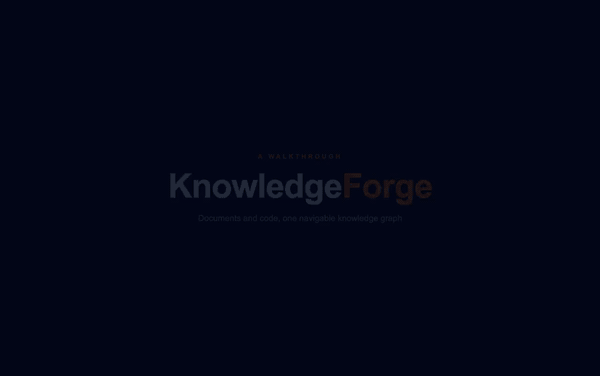
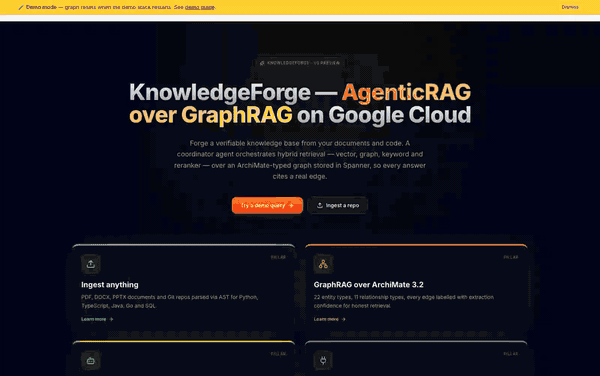

# KnowledgeForge

[](LICENSE)
[](https://github.com/miticojo-labs/knowledgeforge/actions/workflows/ci.yml)

**KnowledgeForge is a personal, open-source experiment in agentic GraphRAG built on Google Cloud.** It is *not* an official Google reference architecture — it's one engineer's take on how to stitch Cloud Spanner (with Property Graph), Gemini 2.5, Gemini Embedding 2, Vertex AI, the Model Context Protocol, and the Universal Knowledge Catalog (formerly Dataplex) into a working hybrid-retrieval knowledge base. Fully forkable, fully runnable on a laptop.

What it demonstrates concretely:

- **Hybrid retrieval on Spanner Graph** — the same store provides vector search (768d cosine), GQL graph traversal, and keyword `LIKE` matching. A coordinator agent picks the strategy per query and fuses results with weighted RRF + Vertex AI reranking. Code in [`kb-agent/agents/coordinator.py`](kb-agent/agents/coordinator.py) and [`kb-agent/agents/search.py`](kb-agent/agents/search.py).
- **Architecture-aware GraphRAG** — graph extraction is constrained by Pydantic `Literal` enums (Controlled Generation), so every edge lands in one of 22 entity / 11 relation tables with EXTRACTED / INFERRED / AMBIGUOUS confidence labels. The graph reasons about *systems*, not just *paragraphs*.
- **Documents and source code in one graph** — PDF/DOCX/PPTX upload *or* a Git URL go through the same pipeline; AST parsers (Python, TypeScript, Java, Go, SQL) project repos onto the same ArchiMate ontology.
- **MCP-native distribution** — the same eight tools (`get_brief`, `query`, `get_entity`, `get_connections`, `god_nodes`, `graph_stats`, `check_conformance`, `impact_analysis`) are reachable from Gemini CLI, Claude Code, Codex, or any MCP-aware agent through [`kb-mcp-server/`](kb-mcp-server/).
- **Universal Knowledge Catalog bridge (opt-in)** — KF can publish its `DataObject` graph back into UKC and re-ingest UKC entries as ArchiMate `DataObject`s, so the graph can grow into the enterprise knowledge backbone alongside the catalog you already have. See [`services/kc_exporter.py`](kb-agent/services/kc_exporter.py) and [`services/kc_importer.py`](kb-agent/services/kc_importer.py).
- **Runs offline** — `docker-compose.demo.yml` boots the full stack against the Spanner emulator with no GCP project required (only a Gemini API key).

> **New to RAG?** Start with [`docs/concepts/rag-primer.md`](docs/concepts/rag-primer.md) for a 5-minute introduction to RAG, GraphRAG, and AgenticRAG — the three paradigms KnowledgeForge combines.

### See it in action

Two videos are available — pick whichever fits your purpose.

**1. Narrated walkthrough** (1:43 · MP4 7.9 MB · GIF 11 MB) — built with [Remotion](https://www.remotion.dev/), each scene gets a contextual caption explaining what's on screen. Best as a guided tour.



[`demo/recording/walkthrough_narrated.mp4`](demo/recording/walkthrough_narrated.mp4) — re-render with `cd demo/remotion && npm run build` (Remotion source under `demo/remotion/src/`).

**2. Live UI capture** (3:48 · MP4 2.3 MB · GIF 3.3 MB) — raw screen recording with no captions, real timing of the app. Best to see the actual interaction speed.



[`demo/recording/walkthrough_live.mp4`](demo/recording/walkthrough_live.mp4) — re-record with `node demo/recording/record.mjs` (after `npm install` in `demo/recording/`).

Terminal seed/query playback: [`demo/recording/walkthrough.cast`](demo/recording/walkthrough.cast) (open with `asciinema play`).

## Google Cloud building blocks

Each item below is something the codebase actually uses today — not a roadmap item.

| Building block | Role in KnowledgeForge | Where it lives |
|---|---|---|
| **Cloud Spanner + Property Graph** | Single store for documents, chunks, 22 ArchiMate entity tables, 11 edge tables, and 768d vectors. Hybrid queries combine `COSINE_DISTANCE`, GQL `MATCH … -[rel]- …`, and SQL `LIKE` in one transaction. | [`database/spanner_schema.sdl`](database/spanner_schema.sdl), [`kb-agent/services/spanner_client.py`](kb-agent/services/spanner_client.py) |
| **Gemini 2.5 Flash** | Reasoning + orchestration: query expansion (fact / context / temporal), graph extraction with Controlled Generation, coordinator synthesis with claim-level verification. | [`kb-agent/agents/coordinator.py`](kb-agent/agents/coordinator.py), [`kb-agent/services/document_ingester.py`](kb-agent/services/document_ingester.py) |
| **Gemini Embedding 2** (`gemini-embedding-2-preview`, 768d) | Native multimodal embeddings — text *and* page-extracted images live in the same vector space, used for chunk retrieval and entity reconciliation. | [`kb-agent/services/document_chunker.py`](kb-agent/services/document_chunker.py), [`kb-agent/services/entity_reconciler.py`](kb-agent/services/entity_reconciler.py) |
| **Vertex AI** | Optional reranker (`semantic-ranker-512`, top-30 → top-15) and Vertex-backed Gemini client for log-prob probes used by Information Gain Pruning. | [`kb-agent/agents/search.py`](kb-agent/agents/search.py) |
| **Model Context Protocol (MCP)** | Stdio server that exposes the eight KB tools to Gemini CLI / Claude Code / Codex / any MCP client; ships as a Python package and a Node shim. | [`kb-mcp-server/`](kb-mcp-server/) |
| **Universal Knowledge Catalog** (formerly Dataplex Catalog) | Opt-in two-way bridge: KF projects `DataObject` + edges into UKC as Entry / EntryLink / Aspect, and re-ingests UKC entries back as ArchiMate `DataObject`s via Pub/Sub. Off by default — gated by `KC_SYNC_ENABLED` / `KC_IMPORT_ENABLED`. | [`kb-agent/services/kc_exporter.py`](kb-agent/services/kc_exporter.py), [`kb-agent/services/kc_importer.py`](kb-agent/services/kc_importer.py) |
| **Cloud Run** | Target deployment for `kb-agent` (FastAPI + ADK) and `kb-frontend` (Next.js 16). Local dev uses the Spanner emulator instead. | [`deploy_run.sh`](deploy_run.sh), [`docker-compose.demo.yml`](docker-compose.demo.yml) |
| **Model Armor** | Optional pre/post LLM guardrails enabled with `ENABLE_MODEL_ARMOR=true`. | [`kb-agent/agents/security.py`](kb-agent/agents/security.py) |

## Try it on your laptop

```bash
# 1. Put your Gemini API key in kb-agent/.env (auto-loaded by docker compose env_file)
echo "GEMINI_API_KEY=YOUR_KEY" >> kb-agent/.env

# 2. Boot the stack against a local Spanner emulator
docker compose -f docker-compose.demo.yml up -d

# 3. Initialize emulator + ingest the demo repo
./demo/scripts/seed.sh
```

Then open http://localhost:13000 (frontend) and http://localhost:18080 (backend). See [`docs/quickstart-demo.md`](docs/quickstart-demo.md) for the step-by-step guide and [`demo/README.md`](demo/README.md) for the full demo kit.

> The compose file uses `env_file: kb-agent/.env`, so any var declared there (notably `GEMINI_API_KEY` and `GOOGLE_GENAI_USE_VERTEXAI=false`) is propagated automatically — you do not need to `export` anything on the host.

## Quickstart (local dev)

Requires Python 3.11+, Node.js 20+, a GCP project with **Cloud Spanner** + **Vertex AI** enabled, and `gcloud auth application-default login`.

```bash
git clone https://github.com/<you>/knowledgeforge.git
cd knowledgeforge

# Backend
cd kb-agent
python -m venv .venv && source .venv/bin/activate
pip install -r requirements.txt
cp .env.example .env       # fill in GOOGLE_CLOUD_PROJECT, SPANNER_*, DOCLING_URL
python main.py             # http://localhost:8080

# Frontend (in another terminal)
cd ../kb-frontend
npm install
cp .env.example .env.local # fill in BACKEND_URL, LITEPARSE_URL
npm run dev                # http://localhost:3000
```

Schema bootstrap: `database/spanner_schema.sdl` (apply with `gcloud spanner databases ddl update`).

The frontend exposes:

- **Two ingestion tabs**: **Documents** (PDF/DOCX/PPTX upload, parsed by LiteParse) and **Code Repository** (Git URL → AST extraction via `POST /ingest/git`).
- **Welcome landing** (`/welcome`) with hero + four capability cards.
- **Chat** (`/chat`) with entity scope filtering — restrict retrieval to a single entity by toggling the scope banner (sets `X-Entity-Scope` header).
- **Graph explorer** (`/graph`) — standalone navigable canvas with search, ArchiMate layer filters, hub/orphan filters, and click-to-pin selection (see [`docs/concepts/graph-navigation.md`](docs/concepts/graph-navigation.md)).
- **Embedding space** (`/embeddings`) — 3D PCA scatter (768d → 3d via numpy SVD) of stored entity / chunk embeddings, colored by ArchiMate layer. Type any query → it gets embedded with the same model, projected into the cached PCA basis (red cube), and the cosine top-30 hits are highlighted with link lines. Click a point to jump to the same node in `/graph`.
- **Dashboard** (`/dashboard`) — per-tenant cost dashboard, top tenants by spend, daily trend, breakdown by operation type.
- **Glossary tooltips** on technical terms across the UI, **EmptyState** components on every empty list, demo-mode banner with sample query chips.

Knowledge Catalog roundtrip (B+C+D) is **opt-in** via env flags: `KC_SYNC_ENABLED` (KF→KC export), `KC_IMPORT_ENABLED` (KC→KF import via Pub/Sub), `KC_GLOSSARY_ID` (bidirectional `BusinessObject` ↔ glossary term sync). See [`docs/concepts/knowledge-catalog-bridge.md`](docs/concepts/knowledge-catalog-bridge.md).

For Cloud Run deploy, see [`docs/deployment.md`](docs/deployment.md).
For contributing guide, see [`CONTRIBUTING.md`](CONTRIBUTING.md).

## Multi-CLI extension distribution

KnowledgeForge ships as a single-source extension installable into the three major coding-agent CLIs:

| CLI | Manifest |
|---|---|
| Gemini CLI | `gemini-extension.json` |
| Claude Code | `.claude-plugin/plugin.json` |
| Codex | `.codex-plugin/plugin.json` |

All three reuse the same `kb-mcp-server/` backend, so installing KF in any of these CLIs gives you the eight MCP tools described in [MCP Server](#mcp-server-kb-mcp-server) without duplicate config.

## Architecture

Multi-tenant by design: every row carries a `tenant_id` and every query is filtered by the calling user's email-derived tenant (see [docs/multi-tenancy.md](docs/multi-tenancy.md)).

Two serverless services on Cloud Run:

1. **Backend (`kb-agent`)**
   - **Framework**: FastAPI + Google Agent Development Kit (ADK) v1.28+
   - **Protocol**: AG-UI via `ag_ui_adk` for SSE streaming to frontend
   - **Security**: Google Cloud Model Armor
   - **LLM**: Gemini 2.5 Flash for orchestration and processing
   - **Embeddings**: `gemini-embedding-2-preview` (multimodal text + images, 768 dim)
   - **Chunking**: Semantic chunking (~500 tokens) + Contextual Retrieval prefix + multimodal image chunks
   - **Persistence**: Cloud Spanner with entity reconciliation (exact match + vector similarity)
   - **Graph Extraction**: Controlled Generation with confidence labels (EXTRACTED / INFERRED / AMBIGUOUS)
   - **Retrieval**: Hybrid search — vector + GQL graph traversal + keyword + RRF fusion + Vertex AI reranker
   - **Graph Analytics**: God nodes, graph stats, Knowledge Brief generation
   - **MCP Server**: `kb-mcp-server/` exposes the KB to external AI agents (MCP-compatible AI assistants)

2. **Frontend (`kb-frontend`)**
   - **Framework**: Next.js 16 (Turbopack), React 19, Tailwind CSS 4
   - **Agent Integration**: CopilotKit v1.54 + AG-UI
   - **Document Parsing**: LiteParse (PDF with image extraction via PDFium), Mammoth (DOCX), xlsx, JSZip (PPTX)
   - **Graph Visualization**: `react-force-graph-2d` with ArchiMate layer clustering, proportional node sizing, layer filters
   - **Container**: Node.js 20 Alpine

## Application Flow

### Ingestion (Document Processing Pipeline)

```
                         ┌─────────────────┐
                         │  PDF / DOCX /   │
                         │  PPTX / Images  │
                         └────────┬────────┘
                                  │ LiteParse (PDFium + sharp)
                                  ▼
                    ┌─────────────────────────┐
                    │   STEP 1: Metadata      │
                    │   title, author, type,  │
                    │   topics, date          │
                    │   (no LLM call)         │
                    └────────────┬────────────┘
                                 │
              ┌──────────────────┼──────────────────┐
              │    STEP 2-4: PARALLEL PROCESSING    │
              │        ThreadPoolExecutor(3)        │
              ▼                  ▼                  ▼
   ┌──────────────────┐ ┌───────────────┐ ┌─────────────────┐
   │ A. Chunking +    │ │ B. Graph      │ │ C. Entity       │
   │    Embedding     │ │    Extraction │ │    Search       │
   │                  │ │               │ │                 │
   │ 1. Semantic      │ │ Controlled    │ │ Vector search   │
   │    split (~1500  │ │ Generation    │ │ across 8 entity │
   │    chars/chunk)  │ │ (JSON schema) │ │ tables (cosine) │
   │                  │ │               │ │                 │
   │ 2. Contextual    │ │ Extracts:     │ │ Returns top-10  │
   │    Retrieval     │ │ • 22 entity   │ │ existing entity │
   │    (batch LLM    │ │   types       │ │ matches for     │
   │    prefix)       │ │ • 11 relation │ │ reconciliation  │
   │                  │ │   types       │ │                 │
   │ 3. Batch embed   │ │ • confidence  │ │ Model:          │
   │    (100/batch)   │ │   labels      │ │ gemini-embed-2  │
   │                  │ │               │ └─────────────────┘
   │ Models:          │ │ Model:        │
   │ gemini-2.5-flash │ │ gemini-2.5-   │
   │ gemini-embed-2   │ │ flash (T=0)   │
   │                  │ │               │
   │ Output:          │ │ Output:       │
   │ Chunks[] + 768d  │ │ Nodes[] +     │
   │ embeddings +     │ │ Edges[] +     │
   │ doc avg vector   │ │ Confidence    │
   └──────────────────┘ └───────────────┘
              │                  │
              └────────┬─────────┘
                       ▼
          ┌─────────────────────────┐
          │  STEP 5: Write to      │
          │       Spanner          │
          │                        │
          │ 1. Parse nodes/edges   │
          │    (regex)             │
          │ 2. Compute entity      │
          │    embeddings (batch)  │
          │ 3. Entity reconcile:   │
          │    exact → vector      │
          │    (< 0.15) → new     │
          │ 4. Build mutations     │
          │ 5. Atomic batch write  │
          │    (5000 mut/batch)    │
          │ 6. Idempotent: delete  │
          │    old doc if exists   │
          └────────────┬──────────┘
                       ▼
          ┌─────────────────────────┐
          │     Spanner Tables      │
          │                         │
          │ • Documents             │
          │ • DocumentChunks (768d) │
          │ • 22 Entity tables      │
          │ • 11 Edge tables        │
          │ • DocumentMentions      │
          │ • ChunkMentions         │
          └─────────────────────────┘
                       │
                       ▼
              UI: Pipeline steps +
              Knowledge Graph + Images
```

The frontend captures `TOOL_CALL_START/ARGS/RESULT` events from the AG-UI SSE stream via a fetch interceptor and updates the pipeline UI.

> **Controlled Generation**: The `extract_graph` step uses Gemini's `response_schema` (Controlled Generation) with a Pydantic schema that enforces valid ArchiMate types via `Literal` enums. This guarantees 100% schema compliance — no regex normalization needed. Benchmarked at +14.8% Node F1 and +67.5% Edge F1 vs free-form extraction.

> **Confidence Labels**: Every extracted relationship is labeled EXTRACTED (explicitly stated in text), INFERRED (deduced from context), or AMBIGUOUS (uncertain). The retrieval pipeline filters AMBIGUOUS edges and weights RRF boost by confidence level. Inspired by [Graphify](https://github.com/safishamsi/graphify).

> **Temporal Grounding**: The `extract_metadata` step extracts `document_date` (publication/creation date) from the document. This date is stored in Spanner, included in search results, and used by the Coordinator for temporal reasoning (preferring newer documents when facts conflict).

### Search (Hybrid Retrieval — HippoRAG-inspired)

```
                    ┌──────────────┐
                    │  User Query  │
                    └──────┬───────┘
                           │
                           ▼
              ┌────────────────────────┐
              │  CoordinatorAgent      │
              │  gemini-2.5-flash      │
              │  thinking: 4096 tokens │
              │  temperature: 0.1      │
              └────────────┬───────────┘
                           │ tool call
                           ▼
    ┌──────────────────────────────────────────────┐
    │     tool_query_spanner_graph (SearchAgent)   │
    │                                              │
    │  ┌────────────────────────────────────────┐   │
    │  │  1. QUERY EXPANSION                   │   │
    │  │     gemini-2.5-flash (T=0.7)          │   │
    │  │     → fact_query                      │   │
    │  │     → context_query                   │   │
    │  │     → temporal_query                  │   │
    │  │     → graph_needed (adaptive gate)    │   │
    │  └──────────────────┬─────────────────────┘   │
    │                     │                        │
    │  ┌──────────────────▼─────────────────────┐   │
    │  │  2. MULTI-QUERY EMBEDDING             │   │
    │  │     gemini-embedding-2-preview        │   │
    │  │     768d × 4 variants (parallel)      │   │
    │  └──────────────────┬─────────────────────┘   │
    │                     │                        │
    │       ┌─────────────┼─────────────┐          │
    │       ▼             ▼             ▼          │
    │  ┌─────────┐  ┌──────────┐  ┌──────────┐    │
    │  │Keyword  │  │ Vector   │  │  Graph   │    │
    │  │Search   │  │ Search   │  │ Search   │    │
    │  │         │  │          │  │(if gate  │    │
    │  │OR-logic │  │ScaNN ANN │  │ =true)   │    │
    │  │LIKE     │  │COSINE    │  │          │    │
    │  │matching │  │DISTANCE  │  │1-hop GQL │    │
    │  │         │  │< 0.45    │  │2-hop GQL │    │
    │  │max: 20  │  │max: 20   │  │ChunkMent │    │
    │  └────┬────┘  └────┬─────┘  └────┬─────┘    │
    │       │            │             │           │
    │       └────────────┼─────────────┘           │
    │                    ▼                         │
    │  ┌─────────────────────────────────────────┐  │
    │  │  3. WEIGHTED RRF FUSION                │  │
    │  │     keyword:  w=0.4                    │  │
    │  │     vector:   w=1.0                    │  │
    │  │     graph:    w=0.3                    │  │
    │  │     expanded: w=0.5                    │  │
    │  │     RRF_K = 60                         │  │
    │  └──────────────────┬──────────────────────┘  │
    │                     ▼                        │
    │  ┌─────────────────────────────────────────┐  │
    │  │  4. SEMANTIC RERANKING                 │  │
    │  │     Vertex AI semantic-ranker-512      │  │
    │  │     top-30 → top-15                    │  │
    │  └──────────────────┬──────────────────────┘  │
    │                     │                        │
    │  Returns: chunks + graph connections +        │
    │           [IMAGE:...] tags + metrics          │
    └─────────────────────┼────────────────────────┘
                          │
                          ▼
    ┌──────────────────────────────────────────────┐
    │       COORDINATOR SYNTHESIS                  │
    │                                              │
    │  1. EXTRACT   — facts from each chunk        │
    │  2. SYNTHESIZE — coherent answer             │
    │  3. GRAPH CHAINS — 2-hop dependency tracing  │
    │  4. VERIFY    — SUPPORTED / CONTRADICTED /   │
    │                 UNSUPPORTED per claim         │
    │  5. TEMPORAL  — prefer newer documents       │
    │                                              │
    │  Output: answer + <sources> JSON block       │
    └──────────────┬───────────────────────────────┘
                   │
                   ▼
          after_model_callback
          → deterministic image injection
          → DocAgent (optional report)
```

**Graph search patterns (GQL):**

| Pattern | Query | Max results |
|---------|-------|-------------|
| **1-hop** | `MATCH (src:Entity)-[rel]-(tgt) WHERE COSINE_DISTANCE < 0.45` | 5 per entity type |
| **2-hop chains** | `MATCH (src)-[r1]-(mid)-[r2]-(tgt) WHERE COSINE_DISTANCE < 0.55` | 3 per pattern |
| **ChunkMentions** | `JOIN ChunkMentions ON discovered entity IDs` | 10 chunks |

**Five hardcoded 2-hop chain patterns:**
- `SystemSoftware → ApplicationComponent → BusinessProcess`
- `SystemSoftware → ApplicationComponent → BusinessService`
- `ApplicationComponent → BusinessProcess → Goal`
- `ApplicationComponent → BusinessProcess → Capability`
- `Node → SystemSoftware → ApplicationComponent`

The hybrid search combines multiple strategies in a single Spanner query, inspired by [HippoRAG](https://arxiv.org/abs/2405.14831) (NeurIPS 2024):

1. **Specialist multi-query**: generates 3 specialized queries (fact, context, temporal) instead of generic reformulations. Inspired by [Supermemory ASMR](https://blog.supermemory.ai/we-broke-the-frontier-in-agent-memory-introducing-99-sota-memory-system/)
2. **Parallel retrieval**: embedding + vector search run concurrently via ThreadPoolExecutor
3. **Vector similarity** on `chunk_embedding` to find semantically similar passages
4. **Graph traversal** (1-3 hops) via GQL for ArchiMate relationship discovery — equivalent to Personalized PageRank (PPR)
5. **Cross-document provenance**: SQL join with `ChunkMentions` to find text passages from graph-discovered entities
6. **Deterministic image injection**: `after_model_callback` ensures images found by the search tool always appear in the response, bypassing LLM judgment

> **Out-of-Band Telemetry**: The `kb-agent` exposes a dedicated side-channel endpoint (`GET /tenant/latest-metadata`) which proxies internal LLM/Spanner query costs to the frontend independently of CopilotKit SSE streams. This guarantees high-fidelity UI dashboards without polluting generative responses.

## Graph Analytics API

The backend exposes REST endpoints for graph introspection, used by the MCP server and directly:

| Endpoint | Description |
|----------|-------------|
| `GET /graph/stats` | Aggregate statistics: entities by type, edges by type, confidence distribution, document/chunk counts |
| `GET /graph/god-nodes?top_n=10` | Most-connected entities (architectural hubs) sorted by degree |
| `GET /graph/brief` | Structured Knowledge Brief — overview, core entities, relationships, gaps, conformance report, sources |
| `GET /graph/entity/{type}/{name}` | Entity lookup by ArchiMate type and name |
| `GET /graph/connections/{entity_id}` | All 1-hop connections (incoming + outgoing) with confidence labels |
| `GET /graph/conformance` | Validate graph against architecture and data governance rules (YAML-defined). Returns pass/warning/error per rule |
| `GET /graph/impact/{type}/{name}?max_hops=4` | Blast radius analysis via BFS with confidence decay (EXTRACTED=1.0, INFERRED=0.5, AMBIGUOUS=0.0) |
| `GET /embeddings/projection?kind=entities\|chunks&limit=N&refresh=bool` | 3D PCA projection of stored 768d embeddings (numpy SVD). Cached per (tenant, kind). |
| `POST /embeddings/nearest` | Body `{q, kind, top_k}`. Embeds the query, returns the projected query position + cosine top-K hit ids/scores against the cached embedding matrix. |

## MCP Server (`kb-mcp-server/`)

Exposes the Knowledge Base to external AI agents (MCP-compatible AI assistants) via the Model Context Protocol (MCP). Runs locally as a lightweight stdio proxy, calling the Cloud Run backend via HTTP.

```bash
pip install -e kb-mcp-server/
kb-mcp serve --backend-url https://kb-agent-XXXX.run.app
```

**Tools exposed:**

| Tool | Description |
|------|-------------|
| `get_brief` | Knowledge Brief — structured overview with conformance report for agent orientation |
| `query` | Natural language query against the full retrieval pipeline |
| `get_entity` | Entity lookup by type and name |
| `get_connections` | 1-hop connections with confidence labels |
| `god_nodes` | Most-connected entities (architectural hubs) |
| `graph_stats` | Aggregate graph statistics |
| `check_conformance` | Validate graph against architecture and data governance rules |
| `impact_analysis` | Blast radius from an entity — BFS with confidence decay across all layers |

**MCP client configuration** (e.g. an `mcp.json` file consumed by your IDE):
```json
{
  "mcpServers": {
    "kb": {
      "command": "kb-mcp",
      "args": ["serve", "--backend-url", "https://kb-agent-XXXX.run.app"]
    }
  }
}
```

## Data Model: Document ↔ Chunk ↔ Entity

```
┌──────────────┐     1:N      ┌──────────────┐     N:M      ┌──────────────┐
│  Documents   │──────────────│DocumentChunks │──────────────│  Entities    │
│              │              │               │ (ChunkMentions) │ (22 tables) │
│  doc_id (PK) │              │ chunk_id (PK) │              │  entity_id   │
│  title       │              │ doc_id (FK)   │              │  name        │
│  source_uri  │              │ chunk_index   │              │  embedding   │
│  chunk_embed │              │ chunk_text    │              │  source_doc_id│
│  doc_date    │              │ chunk_embed   │              └──────────────┘
│  created_at  │              │ chunk_type    │  ← "text" | "image"
└──────────────┘              │ chunk_type    │  ← "text" | "image"
                              │ page_number   │
                              └───────────────┘
```

- **Retrieval**: find most similar chunks via vector search, then discover related entities via graph traversal
- **Provenance**: for each entity, trace back to the specific chunk/page in the source document
- **Multimodal**: image chunks contain embeddings from PDF-extracted figures
- **Confidence**: every edge in the 11 relationship tables has a `confidence` column (EXTRACTED / INFERRED / AMBIGUOUS) — used for retrieval weighting and token budget prioritization

## Entity Reconciliation (iText2KG-inspired)

When a new document is processed, extracted entities are reconciled with existing ones in the Knowledge Graph, inspired by [iText2KG](https://arxiv.org/abs/2409.03284):

1. **Exact match** (fast path): case-insensitive name lookup in Spanner
2. **Vector similarity**: if not found, compute `COSINE_DISTANCE` between entity embeddings. If distance < 0.15 (similarity > 0.85) → **merge** (reuse existing ID, create new edges)
3. **New entity**: otherwise create a new entity with fresh UUID

This ensures that processing 10 documents mentioning "CRM System" results in **a single node** with all relationships aggregated across documents.

## Deployment (Cloud Run)

```bash
./deploy_run.sh
```

The script handles:
1. Build and deploy FastAPI backend to Cloud Run
2. Auto-retrieve the generated `BACKEND_URL`
3. Build and deploy Next.js frontend with backend URL injected

### IAP (Identity-Aware Proxy)

The frontend is protected by Google Cloud IAP. Access is limited to authorized users via the `roles/iap.httpsResourceAccessor` role.

## Local Development

### Backend
```bash
cd kb-agent
python -m venv .venv && source .venv/bin/activate
pip install -r requirements.txt
# Configure .env with GOOGLE_API_KEY, SPANNER_INSTANCE, SPANNER_DATABASE
python main.py  # Starts on http://localhost:8080 with hot-reload
```

### Frontend
```bash
cd kb-frontend
npm install
npm run dev  # Starts on http://localhost:3000
```

### MCP Server
```bash
pip install -e kb-mcp-server/
kb-mcp serve --backend-url http://localhost:8080  # or Cloud Run URL
```

Backend must be running on port 8080 (default in `app/api/copilotkit/route.ts`).

## Technology Stack

| Component | Technology |
|---|---|
| Backend Framework | FastAPI + Google ADK |
| Frontend Framework | Next.js 16 + React 19 |
| Agent Protocol | AG-UI (SSE) via `ag_ui_adk` |
| Agent UI | CopilotKit v1.54 |
| LLM | Gemini 2.5 Flash (Vertex AI) |
| Embeddings | gemini-embedding-2-preview (multimodal, 768 dim) |
| Chunking | Semantic chunking + Contextual Retrieval + multimodal image chunks |
| Graph Extraction | Controlled Generation (response_schema + Pydantic Literal enums) |
| Database | Cloud Spanner (Graph Property DB + Vector Search) |
| Entity Resolution | iText2KG-inspired (exact match + cosine similarity) |
| Retrieval | Hybrid: vector + graph traversal + SQL (HippoRAG-inspired) |
| PDF Parsing | LiteParse + PDFium + sharp (figure crop from page screenshots) |
| Image Pipeline | Deterministic injection via after_model_callback (bypasses LLM) |
| Edge Confidence | EXTRACTED / INFERRED / AMBIGUOUS labels on all 11 relationship tables |
| Graph Analytics | God nodes, graph stats, Knowledge Brief generation |
| Conformance | YAML-defined architecture + data governance rules with automated validation |
| Impact Analysis | BFS blast radius with confidence decay across ArchiMate layers |
| MCP Server | `kb-mcp-server/` — 8 tools for external AI agents (MCP-compatible AI assistants) |
| Multi-Query | Specialist queries (fact/context/temporal) + parallel embedding |
| Graph Viz | react-force-graph-2d (clustering, layer filters, hover) |
| Security | Model Armor + IAP |
| IaC | Terraform |
| Deploy | Cloud Run (europe-west1) |

## Security and Guardrails

Setting `ENABLE_MODEL_ARMOR=true` enables checks on every query and agent response. Custom filters block IP extraction, obfuscate prompt attacks, and inhibit off-scope explicit content. Logic triggered in `before_agent_security_check`.

## References

| Paper | Use in this project |
|---|---|
| [iText2KG](https://arxiv.org/abs/2409.03284) (2024) | Entity reconciliation with cosine similarity threshold 0.85 for incremental Knowledge Graph construction |
| [HippoRAG](https://arxiv.org/abs/2405.14831) (NeurIPS 2024) | Hybrid retrieval with Personalized PageRank over the Knowledge Graph — implemented as multi-hop graph traversal in Spanner |
| [LLM-Powered KG for Enterprise](https://arxiv.org/abs/2503.07993) (2025) | Entity-linking and deduplication patterns for enterprise Knowledge Graphs |
| [Gemini Embedding 2](https://blog.google/innovation-and-ai/models-and-research/gemini-models/gemini-embedding-2/) (2026) | First natively multimodal embedding model (text and images in the same vector space) |
| [Contextual Retrieval](https://arxiv.org/abs/2410.16924) (2024) | 2-3 sentence context prepended to chunks before embedding (35-67% failure reduction) |
| [RAG-Fusion](https://arxiv.org/abs/2402.03367) (2024) | Multi-query expansion for improved recall — evolved to specialist queries (fact/context/temporal) |
| [Supermemory ASMR](https://blog.supermemory.ai/we-broke-the-frontier-in-agent-memory-introducing-99-sota-memory-system/) (2026) | Temporal grounding + specialist search agents pattern |
| [Graphify](https://github.com/safishamsi/graphify) (2026) | Confidence labels (EXTRACTED/INFERRED/AMBIGUOUS), token budget for graph traversal, god nodes analysis, Knowledge Brief generation pattern |
| [Architecture as Code](https://www.oreilly.com/library/view/architecture-as-code/9781098159818/) (Ford & Richards, O'Reilly 2025) | Architectural fitness functions, ADL, MCP as anticorruption layer for governance |
| [From Scattered to Structured](https://arxiv.org/abs/2601.19548) (Keim & Kaplan, ICSE 2026) | Automated pipeline for extracting and consolidating architectural knowledge into a structured KB |
| [Architecture Without Architects](https://arxiv.org/abs/2604.04990) (Konrad et al., 2026) | "Vibe architecting" phenomenon — AI agents making implicit architectural decisions requiring governance |
