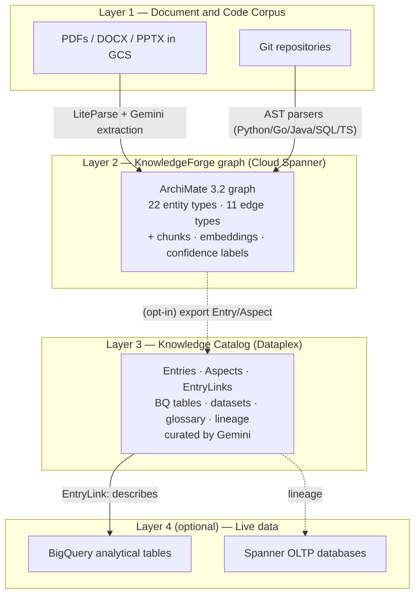
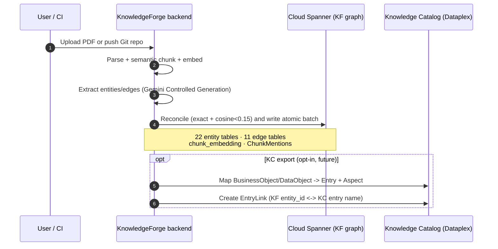
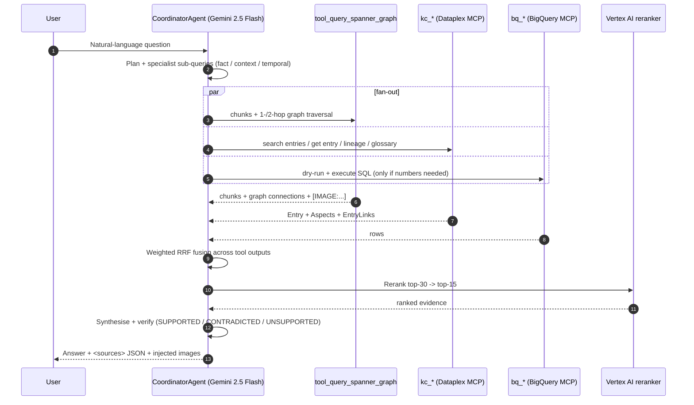

# Reference Architecture — KnowledgeForge + Google Knowledge Catalog on Cloud Spanner

## Audience and TL;DR

**Audience.** Enterprise architects, platform engineers, and data leads who already
run (or plan to run) Google Cloud's **Knowledge Catalog** (KC, the Dataplex /
Universal Catalog metadata surface) and want to combine it with the
**KnowledgeForge** (KF) graph to deliver grounded, multi-source answers to AI
agents and humans.

**TL;DR.** KC catalogs the *cloud assets* (BigQuery tables, datasets, glossary
terms, lineage). KF catalogs the *architecture context* (ArchiMate 3.2 entities
and relationships extracted from PDFs, DOCX, and Git repos). The Model Context
Protocol (MCP) glues the two — the KF Coordinator agent treats `kc_*`,
`bq_*`, and `tool_query_spanner_graph` as peer tools, fuses their outputs, and
returns a verified answer with sources.

---

## 1. Three-layer architecture

- **Layer 1 — Corpus.** Source documents and repositories. Parsing is handled
  by `liteparse-service/` (PDF) and `kb-agent/services/git_ingester.py` plus
  the AST parsers under `kb-agent/services/ast_parsers/`.
- **Layer 2 — KF graph.** Cloud Spanner stores the ArchiMate graph (22 entity
  tables, 11 edge tables), `DocumentChunks` with 768-dim
  `gemini-embedding-2-preview` vectors, and `ChunkMentions` to bridge graph
  and text. Schema: `database/spanner_schema.sdl`.
- **Layer 3 — KC.** Google's managed metadata plane. KF does not own these
  artifacts; it consumes them via the Dataplex MCP toolbox (`kc_*` tools)
  exposed by `@toolbox-sdk/server` and wired in
  `kb-agent/agents/coordinator.py`.
- **Layer 4 — Live data.** Optional BQ execution via the BigQuery MCP toolbox
  (`bq_*` tools) when actual numbers are required to answer.

---

## 2. Two flows

### 2a. Ingestion flow

### 2b. Query flow

---

## 3. Concrete telco example — TM Forum SID overlay

A telco models its customer domain with **TM Forum SID**. The same concept
shows up in three places, and all three need to align.

| Layer | Artefact | Where it lives |
|---|---|---|
| Glossary | Term `CustomerAccount` | KC Glossary |
| Physical | BQ table `oss.customer_account` | KC Entry `bq:oss.customer_account` (auto-discovered) + the actual BQ table |
| Architecture | `BusinessObject:Customer` realised by `DataObject:CustomerAccount`, accessed by `BusinessProcess:Service Activation` | KF graph in Spanner |

KC's `EntryLink` of type **Definition** binds the glossary term to the BQ
entry. KF independently extracts `BusinessObject:Customer` and
`BusinessProcess:Service Activation` from architecture documents and links
them with `Realization` and `Access` edges (real ArchiMate types from
`kb-agent/ontology.yaml`).

**User prompt:**

> "Which business processes touch CustomerAccount, and how many active rows
>  are in the underlying BQ table this month?"

**Coordinator chain (single turn, three tools in parallel):**

1. `tool_query_spanner_graph("CustomerAccount business processes")`
   - Vector hit on chunks describing Service Activation.
   - 1-hop graph traversal: `BusinessObject:Customer` ←`Realization`—
     `DataObject:CustomerAccount` and `BusinessProcess:Service Activation`
     —`Access`→ `DataObject:CustomerAccount`.
2. `kc_search_entries(query="customer_account")` → returns entry
   `bq:oss.customer_account` plus the linked glossary term `CustomerAccount`
   (Definition EntryLink) and lineage upstream.
3. `bq_execute_sql("SELECT COUNT(*) FROM oss.customer_account WHERE
   status='ACTIVE' AND last_updated >= ...")` → live row count.

The Coordinator fuses the three result sets via RRF, reranks, and synthesises
a verified answer with three citation classes: KF chunk IDs, KC entry names,
and the BQ query that was actually run.

---

## 4. Where each piece lives

| Concept | Source path |
|---|---|
| Coordinator agent + MCP toolbox wiring | [`kb-agent/agents/coordinator.py`](../../kb-agent/agents/coordinator.py) (`build_coordinator`) |
| Hybrid search tool | [`kb-agent/agents/search.py`](../../kb-agent/agents/search.py) (`tool_query_spanner_graph`) |
| ArchiMate ontology (22 entities · 11 relations) | [`kb-agent/ontology.yaml`](../../kb-agent/ontology.yaml) |
| Spanner schema (graph + vector) | [`database/spanner_schema.sdl`](../../database/spanner_schema.sdl) |
| Entity reconciliation (iText2KG) | [`kb-agent/services/entity_reconciler.py`](../../kb-agent/services/entity_reconciler.py) |
| Atomic batch graph writes | [`kb-agent/services/graph_writer.py`](../../kb-agent/services/graph_writer.py) |
| Tenant isolation | [`kb-agent/services/tenant_context.py`](../../kb-agent/services/tenant_context.py) |
| Git ingester + AST → ArchiMate | [`kb-agent/services/git_ingester.py`](../../kb-agent/services/git_ingester.py), [`kb-agent/services/ast_to_archimate.py`](../../kb-agent/services/ast_to_archimate.py) |
| Knowledge Brief + analytics | [`kb-agent/services/knowledge_brief.py`](../../kb-agent/services/knowledge_brief.py), [`kb-agent/services/graph_analytics.py`](../../kb-agent/services/graph_analytics.py) |
| MCP server (external clients) | [`kb-mcp-server/kb_mcp_server/server.py`](../../kb-mcp-server/kb_mcp_server/server.py) |
| Multi-MCP integration tests | [`kb-agent/tests/test_coordinator_multi_mcp.py`](../../kb-agent/tests/test_coordinator_multi_mcp.py) |

> **KC exporter status.** A first-class `services/kc_exporter.py` that
> mirrors KF entities into KC `Entry/Aspect/EntryLink` is **not yet in the
> tree** — today the KF→KC direction is read-only via the `kc_*` MCP tools.
> This document treats the export path as a planned extension; see the
> opt-in note in §2a.

---

## 5. Operational concerns

### Environment variables (per layer)

See [`docs/deployment.md`](../deployment.md) for the canonical list.

- **KF core (always required):** `PROJECT_ID`, `SPANNER_PROJECT`,
  `SPANNER_INSTANCE`, `SPANNER_DATABASE`, `REGION`.
- **KC toolbox (opt-in):** `KC_TOOLBOX_ENABLED=true`, `DATAPLEX_PROJECT`.
  Spawns `npx -y @toolbox-sdk/server@>=1.1.0 --prebuilt dataplex --stdio`.
- **BQ toolbox (opt-in):** `BQ_TOOLBOX_ENABLED=true`, `BIGQUERY_PROJECT`,
  `BIGQUERY_LOCATION`. Spawns the prebuilt `bigquery` MCP server.
- **Parsers (optional):** `LITEPARSE_URL`, `DOCLING_URL`.
- **Guardrails (optional):** `ENABLE_MODEL_ARMOR`, `MODEL_ARMOR_TEMPLATE_ID`.

If a toolbox flag is `true` but the required project vars are missing,
`build_coordinator()` raises `RuntimeError` at startup — fail-fast by design.

### Cost model

| Layer | Dominant cost | Notes |
|---|---|---|
| KF ingestion | Vertex AI embeddings + Gemini extraction | Batched 100/req; doc-level dedupe via reconciliation |
| KF storage | Cloud Spanner (graph + 768-dim vectors) | Vector index ScaNN; tenancy via row-level filter |
| KF retrieval | Gemini 2.5 Flash + Vertex reranker | Adaptive graph gate skips traversal when not needed |
| KC | Managed by Google (Dataplex pricing) | Pay per entry + API call |
| BQ | On-demand SQL | Coordinator dry-runs first when supported |

### Security

- **KF tenant isolation.** Every Spanner read/write is pinned to a tenant via
  [`kb-agent/services/tenant_context.py`](../../kb-agent/services/tenant_context.py);
  the scope is set at search start to prevent cross-tenant leakage (see
  commit history `76c141d`, `1d9b5f9`).
- **KC IAM.** Dataplex enforces IAM at the Entry / EntryGroup level; the
  service account running KF only sees what it has been granted.
- **BQ IAM.** The `bq_*` toolbox inherits the Cloud Run service account's
  BigQuery permissions — scope it to dedicated datasets.
- **Model Armor.** Optional pre/post-LLM filtering on every Coordinator turn.
- **IAP.** Frontend access in production is gated by Identity-Aware Proxy.

---

## 6. Cross-links

- [`docs/concepts/rag-primer.md`](../concepts/rag-primer.md) — RAG, GraphRAG, AgenticRAG primer.
- [`docs/integrations/README.md`](../integrations/README.md) — MCP client integrations (Claude Code, Codex, Gemini CLI).
- `docs/concepts/knowledge-catalog-bridge.md` — companion explainer on the KF↔KC bridge (may be added separately).
- [`docs/deployment.md`](../deployment.md) — env vars, Cloud Run deploy, opt-in toolboxes.
