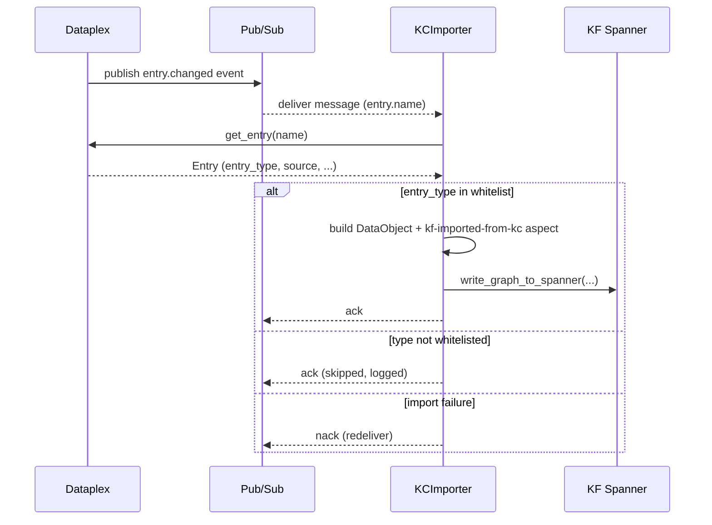

# Knowledge Catalog Bridge

KnowledgeForge owns its graph in Cloud Spanner (ArchiMate 3.2 ontology). Many
enterprises also operate a **Google Knowledge Catalog** (Dataplex Catalog) as
the canonical metadata plane for data assets. The *Knowledge Catalog Bridge*
is the integration layer that lets the two systems exchange structured
metadata without either becoming the slave of the other.

The bridge is delivered in four milestones. This page documents Milestone B
(exporter) and previews C and D.

## Milestones

| Milestone | Direction       | Component                        | Status        |
|-----------|-----------------|----------------------------------|---------------|
| A         | -               | Schema design (Entry/Aspect/EntryLink types) | done   |
| **B**     | KF -> KC        | `kb-agent/services/kc_exporter.py`           | this doc |
| C         | KC -> KF        | Importer (read external assets into KF graph)| planned     |
| **D**     | KF <-> KC       | `kb-agent/services/glossary_sync.py` (BusinessObject <-> KC term) | this doc |

## When to enable

Enable the exporter when:

- Your organization already uses Knowledge Catalog as the source of truth for
  data asset discovery, and you want KF-extracted DataObjects to surface there.
- You want to attach KF provenance (which document, which page, which
  confidence level) to legacy data assets that were imported into KC by older
  pipelines.
- You need EntryLinks between application components and the data they access,
  derived from KF's natural-language extraction.

Leave it disabled (the default) when:

- You're still iterating on the KF ontology — the exporter projects whatever
  the graph currently says, including extraction noise.
- You don't have a Dataplex EntryGroup provisioned yet (see Terraform).

## ArchiMate to KC mapping

The exporter is intentionally narrow: it only projects the slice of the KF
graph that maps cleanly onto Knowledge Catalog primitives.

| KF (ArchiMate)                           | Knowledge Catalog                 | KC type id                  |
|------------------------------------------|------------------------------------|------------------------------|
| `DataObject`                             | `Entry`                            | `kf-legacy-data-object`      |
| `BusinessObject`                         | `Entry`                            | `kf-business-object`         |
| `Access` (App -> Data)                   | `EntryLink`                        | `kf-accesses`                |
| `Realization` (Component -> DataObject)  | `EntryLink`                        | `kf-realizes`                |
| `Realization` (DataObject -> BusinessObject) | `EntryLink`                    | `definition` (KC built-in)   |
| Edge `confidence` + `source_doc_id` + `page` | `Aspect` on each Entry         | `kf-extraction-provenance`   |

Other ArchiMate elements (Capability, BusinessProcess, Node, ...) are *not*
projected — they have no clear KC equivalent and would create noise. The
importer (Milestone C) will go the other way for technology-layer assets.

## How the exporter works

```text
            +-----------------------+
  doc_id -> | KCExporter.export_doc |
            +-----------+-----------+
                        |
            1. read DataObjects + edges  (Spanner)
                        |
            2. compute deterministic entry_id =
                 uuid5(NAMESPACE_DNS, "{doc_id}:{entity_name}")
                        |
            3. build Entry payloads (with provenance Aspect)
            4. build EntryLink payloads (kf-accesses / kf-realizes / definition)
                        |
            5. upsert via CatalogServiceClient
                  (create_entry; on AlreadyExists -> update_entry)
                        v
                   Knowledge Catalog
```

### Idempotency

Every KC resource id is a deterministic `uuid5` of doc_id + entity name (and
link type for EntryLinks). Re-running the exporter for the same `doc_id` is
safe: existing Entries are updated in place, and existing EntryLinks are
left untouched (they're immutable in KC, and their content is fully derived
from the deterministic id, so the existing link is equivalent to the would-be
new one).

### Gating

The exporter is **disabled by default**. To opt in:

```bash
# kb-agent/.env (or runtime env)
KC_SYNC_ENABLED=true
KC_ENTRY_GROUP_ID=kf-import        # Terraform-provisioned EntryGroup
KC_LOCATION=europe-west1
DATAPLEX_PROJECT=your-gcp-project  # may equal GOOGLE_CLOUD_PROJECT
```

Calling `KCExporter.export_doc(doc_id)` while `KC_SYNC_ENABLED` is not set to
`true` raises `KCExportDisabled` so the no-op is explicit at the call site.

### Installing the optional dependency

The Dataplex SDK is an optional extra:

```bash
cd kb-agent
pip install -e ".[kc]"
```

Code that doesn't touch the exporter never imports `google.cloud.dataplex_v1`,
so deployments that don't opt in pay no install-time cost.

### CLI

For ad-hoc backfills:

```bash
cd kb-agent
KC_SYNC_ENABLED=true \
DATAPLEX_PROJECT=my-project \
python -m services.kc_exporter --doc-id <doc-uuid>
```

## Reverse import (Milestone C)

Milestone B is *outbound* (KF -> KC). Milestone C closes the loop with the
*inbound* direction: when an Entry is created or updated in Knowledge Catalog
(e.g. by Dataplex auto-discovery, Terraform, or a steward), the
`KCImporter` projects it into the KF Spanner graph as an ArchiMate
`DataObject`. Together they form a roundtrip: assets KF extracts from
documents are visible in KC, and assets KC discovers from cloud resources are
visible in KF.

### Mapping (KC -> KF)

| KC Entry Type                          | ArchiMate node | Notes                         |
|----------------------------------------|----------------|-------------------------------|
| `bigquery-table`, `bigquery-dataset`   | `DataObject`   | Default whitelist             |
| `cloud-bigtable-table`                 | `DataObject`   |                               |
| `spanner-table`, `spanner-database`    | `DataObject`   |                               |
| `cloud-sql-postgres-table` / `-database` | `DataObject` |                               |
| `alloydb-postgres-table` / `-database` | `DataObject`   |                               |
| anything else                          | *(skipped)*    | Logged + Pub/Sub message acked |

The whitelist (`KC_ENTRY_TYPE_WHITELIST` in `kc_importer.py`) is intentionally
narrow and **extensible**. Add an entry type when you have validated that it
maps cleanly onto `DataObject` semantics.

### Aspect schema — `kf-imported-from-kc`

Every imported node carries a JSON aspect attached as `details`:

```json
{
  "entry_name": "projects/.../entries/bigquery-table-foo",
  "entry_type": "bigquery-table",
  "last_sync_at": "2026-05-04T10:15:00+00:00",
  "source_system": "google-knowledge-catalog"
}
```

This makes it possible to (a) detect KC-originated nodes when computing graph
analytics, and (b) drive incremental re-syncs by comparing `last_sync_at` to
the Entry's KC `update_time`.

Other invariants:

- `source_doc_id = "kc:<entry_name>"` — keeps KC-imported nodes cleanly
  separable from document-extracted ones in `Documents` / `*Mentions`.
- `confidence = EXTRACTED` — KC is treated as authoritative.
- `entity_id = uuid5(NAMESPACE_DNS, entry_name)` — deterministic, so reruns
  upsert in place.

### Pub/Sub setup

Dataplex publishes catalog change events to a Pub/Sub topic. Wiring the
importer is a one-time setup:

1. **Topic + subscription.** Create a Pub/Sub topic (e.g.
   `kc-metadata-changes`) and a pull subscription
   (`kc-metadata-changes-kf`). Grant the KF service account
   `roles/pubsub.subscriber` on the subscription.
2. **Dataplex notifications.** Configure Dataplex to publish entry-change
   events to that topic. (In Console: *Dataplex -> Catalog -> Entry groups
   -> Notifications*; via Terraform: `google_dataplex_entry_group` +
   notification config.)
3. **Importer config.** Set in `kb-agent/.env`:

   ```bash
   KC_IMPORT_ENABLED=true
   KC_IMPORT_SUBSCRIPTION=projects/<proj>/subscriptions/kc-metadata-changes-kf
   DATAPLEX_PROJECT=<proj>
   ```

4. **Run.** Either:

   ```bash
   # streaming daemon (recommended)
   python -m services.kc_importer --subscription "$KC_IMPORT_SUBSCRIPTION"

   # cron-style one-shot pull
   python -m services.kc_importer --once \
     --entries projects/<proj>/.../entries/bigquery-table-foo
   ```

### Streaming vs batch

| Mode      | Method                     | When to use                                  |
|-----------|----------------------------|----------------------------------------------|
| Streaming | `subscribe_streaming(sub)` | Always-on Cloud Run / GKE workload           |
| One-shot  | `subscribe(sub, max=N)`    | Cron job; small bounded pull, exits after N  |
| Batch     | `import_batch([names])`    | Backfill or manual reconciliation            |
| Single    | `import_entry(name)`       | Targeted re-sync (one Entry)                 |

Acks land on import success or explicit "skipped" decisions; nacks fire on
unexpected failures so Pub/Sub redelivers. Malformed payloads are acked (not
nacked) to avoid poison-pill loops — they're surfaced via warnings.

### Sequence



### Gating

Like the exporter, the importer is **off by default**. Calling any public
method while `KC_IMPORT_ENABLED` is unset raises `KCImportDisabled`, so the
no-op is loud at the call site.

## What's next

- **Milestone C extensions**: broaden the whitelist to cover Looker /
  GCS / Dataflow assets and decide whether they should land as
  `ApplicationComponent` rather than `DataObject`.
- **Milestone D — glossary sync**: bidirectional sync between KF
  `BusinessObject` and KC business glossary terms, with the `definition`
  EntryLink keeping data assets attached to their business meaning. See
  [Glossary Bridge](#glossary-bridge-milestone-d) below.

## Glossary Bridge (Milestone D)

While Milestone B projects *data assets* (DataObjects) one-way into KC, the
Glossary Bridge handles *business vocabulary* in both directions. KF's
`BusinessObject` and KC's `GlossaryTerm` model the same concept — a named
business idea with a definition and synonyms — so it's natural to keep them
in sync without picking a winner.

### Bidirectional mapping

| ArchiMate `BusinessObject`         | KC GlossaryTerm                     | Notes                          |
|------------------------------------|-------------------------------------|--------------------------------|
| `object_name`                      | `display_name`                      | Used to derive `term_id` (uuid5) |
| `archimate_layer`                  | parent `Category`                   | Strategy / Business / Application / Technology / Motivation |
| `description` aspect               | `definition`                        | Conflict policy: last-write-wins |
| `synonyms` aspect / `Association` edges (qualifier `synonym`) | `synonyms` list | Conflict policy: union (never lose a synonym) |
| Related-term `Association` edges   | term-to-term references             | Synonym pairs materialize as `Association(BusinessObject -> BusinessObject)` |

### Idempotent IDs

```
term_id            = uuid5(NAMESPACE_DNS, f"{glossary_id}:{business_object_name}")
business_object_id = uuid5(NAMESPACE_DNS, f"glossary:{glossary_id}:{term_id}")
```

A given name in a given glossary always resolves to the same UUID on both
sides, so `sync` can be re-run safely.

### Conflict policy

| Conflict                                | Resolution            |
|-----------------------------------------|-----------------------|
| Description differs between KF and KC   | last-write-wins       |
| Synonym lists differ                    | union (merged set)    |
| Term/BusinessObject deleted on one side | **no-op** on opposite side — the bridge is additive |

### When to push vs pull

- **Push** (`KF -> KC`): you've extracted BusinessObjects from documents
  with KF and want a glossary steward to curate them in KC. Run after
  ingestion, optionally scoped to one `--doc-id`.
- **Pull** (`KC -> KF`): your KC glossary is the canonical business
  vocabulary. Run periodically so KF retrieval can resolve user queries
  against the curated terms (and their synonyms).
- **Both** (`--direction both`): default. Push first to surface local
  BusinessObjects, then pull to merge any KC-side edits made by glossary
  stewards in the same run.

### CLI

```bash
cd kb-agent
DATAPLEX_PROJECT=my-project \
KC_GLOSSARY_ID=kf-glossary \
python -m kb_agent.services.glossary_sync --direction both --doc-id <doc-uuid>
```
